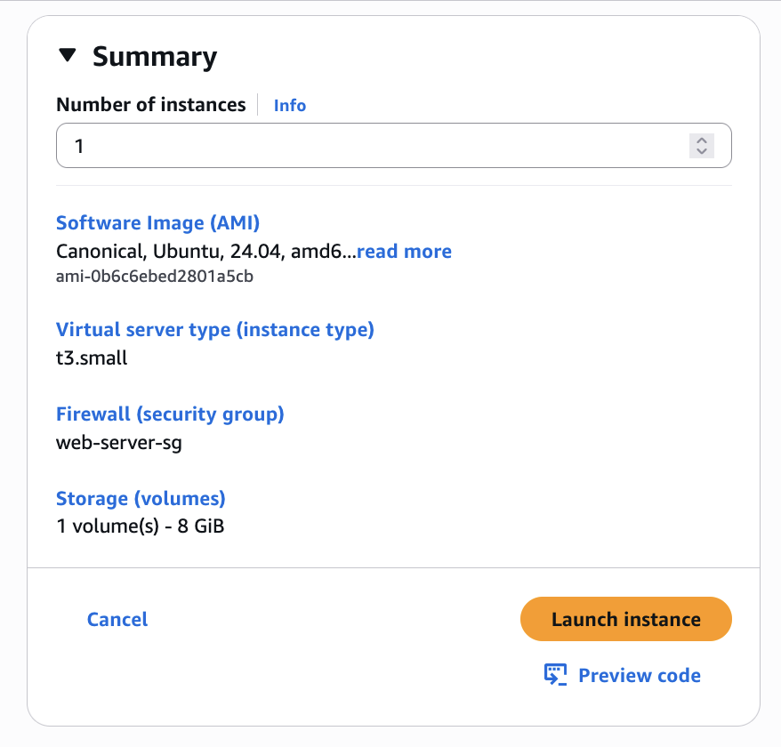
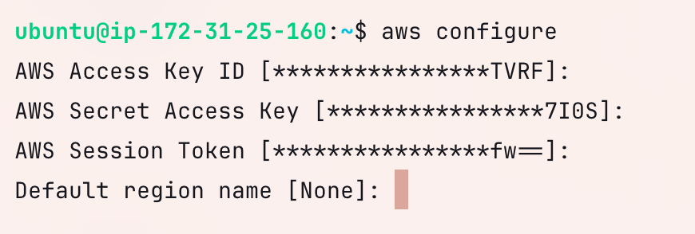
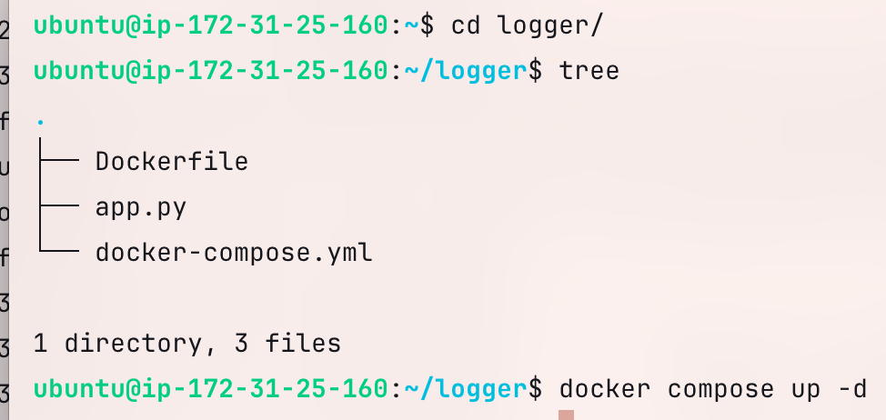
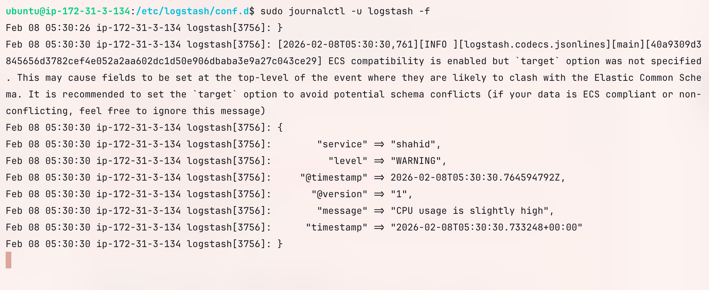
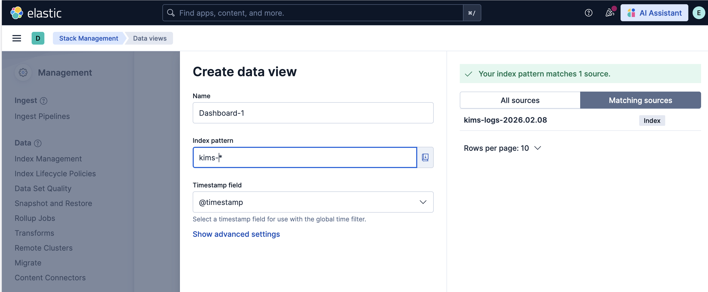
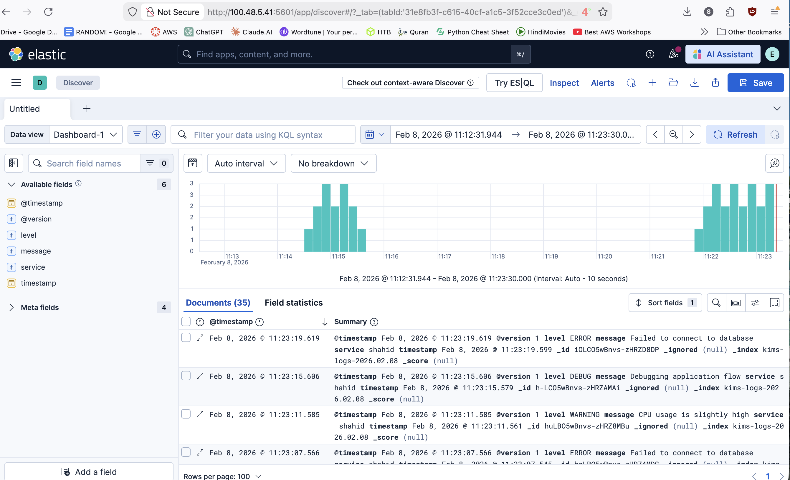
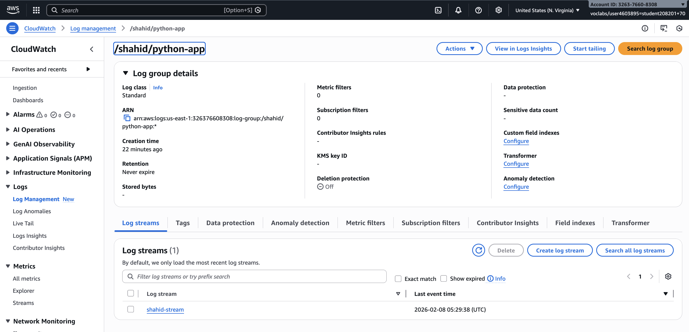
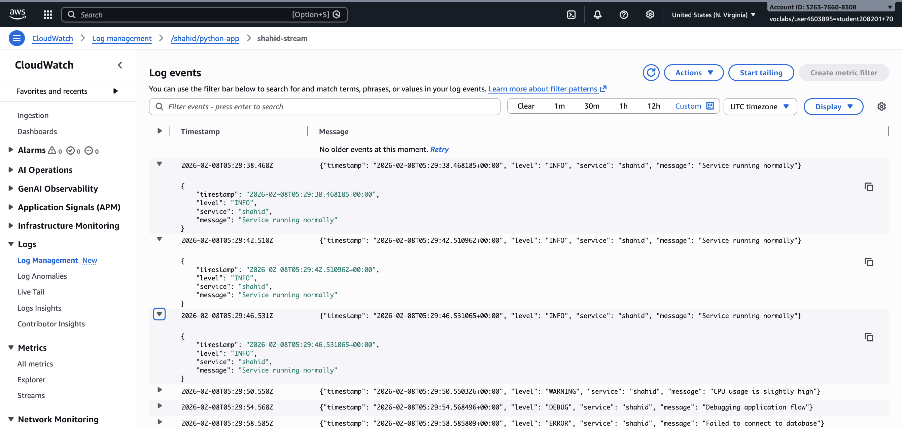

# Cloudwatch + EKS

## 1. Pre-requisistes

- ELK stack

## 2. Create a Log Generating App

### Create ec2



### app.py

```python
import json 
import sys 
import time 
import random 
from datetime import datetime, timezone 
import socket 
import boto3 
from botocore.exceptions import ClientError 

LEVELS = ["INFO", "WARNING", "ERROR", "DEBUG"] 
MESSAGES = { "INFO": "Service running normally", 
            "WARNING": "CPU usage is slightly high", 
            "ERROR": "Failed to connect to database", 
            "DEBUG": "Debugging application flow" } 

# For logstash connection 
LOGSTASH_HOST = "172.31.3.134" 
LOGSTASH_PORT = 5044 

sequence_token = None

# For AWS CloudWatch Logs 
AWS_REGION = "us-east-1" 
LOG_GROUP = "/shahid/python-app" 
LOG_STREAM = "shahid-stream" 

client = boto3.client("logs", region_name=AWS_REGION) 

def init_cloudwatch(): 
    """Ensure log group and stream exist""" 
    global sequence_token 
    try: 
        client.create_log_group(logGroupName=LOG_GROUP) 
    except ClientError as e: 
        if e.response["Error"]["Code"] != "ResourceAlreadyExistsException": 
            raise 
    try: 
        client.create_log_stream( 
            logGroupName=LOG_GROUP, 
            logStreamName=LOG_STREAM
        ) 
    except ClientError as e: 
        if e.response["Error"]["Code"] != "ResourceAlreadyExistsException": 
            raise 
            
    # fetch sequence token if stream already exists 
    streams = client.describe_log_streams( 
        logGroupName=LOG_GROUP, 
        logStreamNamePrefix=LOG_STREAM 
    ) 
    if streams["logStreams"]: 
        sequence_token = streams["logStreams"][0].get("uploadSequenceToken") 
        
def send_to_cloudwatch(log): 
    """Send log event to CloudWatch Logs""" 
    global sequence_token 
    event = { "timestamp": int(time.time() * 1000), 
               "message": json.dumps(log) 
        } 
    kwargs = { 
        "logGroupName": LOG_GROUP, 
        "logStreamName": LOG_STREAM, 
      "logEvents": [event] 
    
    } 
    if sequence_token: 
        kwargs["sequenceToken"] = sequence_token 
    try: 
        response = client.put_log_events(**kwargs) 
        sequence_token = response["nextSequenceToken"] 
    except ClientError as e: 
        print(f"CloudWatch send failed: {e}", file=sys.stderr) 
        
        
        
def send_to_logstash(log): 
    try: 
        sock = socket.socket(socket.AF_INET, socket.SOCK_STREAM) 
        sock.connect((LOGSTASH_HOST, LOGSTASH_PORT)) 
        sock.sendall((json.dumps(log) + "\n").encode("utf-8")) 
        sock.close() 
    except Exception as e: 
        print(f"Logstash send failed: {e}", file=sys.stderr) 

        
if __name__ == "__main__": 
    init_cloudwatch() 
    
    while True: 
        level = random.choice(LEVELS) 
        log = { "timestamp": datetime.now(timezone.utc).isoformat(), 
               "level": level, 
               "service": "shahid", 
               "message": MESSAGES[level] 
               } 
        send_to_cloudwatch(log) 
        send_to_logstash(log) 
        time.sleep(4)

```

### Dockerfile

```docker
FROM python:3.11-slim

WORKDIR /app

RUN pip install --no-cache-dir boto3

COPY app.py .

CMD ["python", "app.py"]
```

### docker-compose.yml

```yaml
services:
  log-app:
    build: .
    container_name: python-logger
    volumes:
      - ~/.aws:/root/.aws:ro
    environment:
      AWS_REGION: us-east-1
      CW_LOG_GROUP: python-logger
      CW_LOG_STREAM: shahid-stream
      LOGSTASH_HOST: 172.31.3.134
      LOGSTASH_PORT: 5044
```

### Configuring the EC2

**Add AWS Credentials**

```docker
sudo apt-get install unzip

curl "https://awscli.amazonaws.com/awscli-exe-linux-x86_64.zip" -o "awscliv2.zip"
unzip awscliv2.zip
sudo ./aws/install

mkdir ~/.aws
vi ~/.aws/credentials
```

**Verify AWS Credentials**

```docker
aws configure
```



**Install Docker and Docker Compose**

Use sudo

```bash
apt update -y
apt install -y ca-certificates curl 
install -m 0755 -d /etc/apt/keyrings
curl -fsSL https://download.docker.com/linux/ubuntu/gpg -o /etc/apt/keyrings/docker.asc
chmod a+r /etc/apt/keyrings/docker.asc
tee /etc/apt/sources.list.d/docker.sources <<EOL
Types: deb
URIs: https://download.docker.com/linux/ubuntu
Suites: $(. /etc/os-release && echo "${UBUNTU_CODENAME:-$VERSION_CODENAME}")
Components: stable
Signed-By: /etc/apt/keyrings/docker.asc
EOL
apt update -y
apt install -y docker-ce docker-ce-cli containerd.io docker-buildx-plugin docker-compose-plugin
usermod -aG docker ubuntu
newgrp docker
```

### Run the python application

```bash
docker compose up -d
```



## 3. Logstash

checking the logs

```bash
sudo journalctl -u Logstash -f
```



## 4. KIBANA

Creating Data View



The created data-view can be found under the **Discover section**



## 5. Cloudwatch

LogGroup /shahid/python-app is created



LogStream shahid-stream is created

